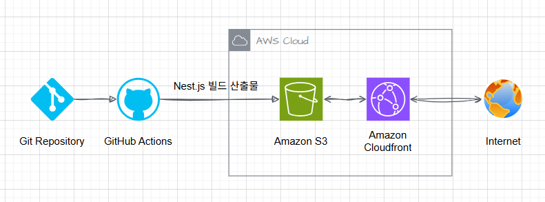

# 배포 파이프라인 구축 가이드

## 소개

1. 저장소를 체크아웃합니다.
2. Node.js 18.x 버전을 설정합니다.
3. 프로젝트 의존성을 설치합니다.
4. Next.js 프로젝트를 빌드합니다.
5. AWS 자격 증명을 구성합니다.
6. 빌드된 파일을 S3 버킷에 동기화합니다.
7. CloudFront 캐시를 무효화합니다.

## 주요 링크

- S3 버킷 웹사이트 엔드포인트: http://hanghae-test-bucket.s3-website-ap-southeast-2.amazonaws.com
- CloudFrount 배포 도메인 이름: https://d2ebp1lqx0gvo2.cloudfront.net

## 주요 개념

### GitHub Actions과 CI/CD 도구

1. GitHub Actions
   - GitHub 에서 제공하는 CI/CD 자동화 도구
   - 직접 워크플로우를 작성하고, 코드 변경 시 빌드, 테스트, 배포 등 자동화 작업을 설정
2. CI/CD 도구
   - CI(Continuous Integration) : 코드 변경사항을 중앙으로 통합, 빌드와 테스트 자동화
   - CD(Continuous Delivery) : 코드 변경사항을 자동으로 지속적으로 배포, 배포 자동화
   - Jenkins, 서클CI, GitLab 등

### S3와 스토리지

1. S3
   - AWS에서 제공하는 객체 스토리지 서비스
   - 대용량 데이터를 안전하고 효율적으로 저장하고 관리할 수 있는 플랫폼
2. 스토리지
   - 데이터를 저장할 수 있는 장치나 시스템을 의미
   - 물리적 저장장치(하드 드라이브, SSD 등) 또는 클라우드 스토리지(예: AWS S3, Google Cloud Storage 등)로 분류

### CloudFront와 CDN

1. CloudFront
   - AWS에서 제공하는 콘텐츠 전송 네트워크(CDN) 서비스
   - 엣지 로케이션을 통해 웹 콘텐츠를 빠르고 효율적으로 사용자에게 전송
2. CDN(Content Delivery Network)
   - 웹 콘텐츠(이미지, 비디오, 스크립트 등)를 사용자에게 더 빠르게 전달하기 위해 서버를 분산시켜 놓은 네트워크
   - 사용자가 요청한 콘텐츠를 가장 가까운 서버에서 제공하여 속도를 향상

### 캐시 무효화(Cache Invalidation)

- 캐시된 데이터가 더 이상 유효하지 않다고 간주하고 이를 삭제하거나 갱신하는 과정
- 웹 애플리케이션에서 업데이트된 콘텐츠나 파일을 사용자에게 빠르게 제공하기 위해 사용

### Repository secret과 환경변수

1. Repository secret
   - AWS에서 제공하는 콘텐츠 전송 네트워크(CDN) 서비스
   - 엣지 로케이션을 통해 웹 콘텐츠를 빠르고 효율적으로 사용자에게 전송
2. CDN(Content Delivery Network)
   - 웹 콘텐츠(이미지, 비디오, 스크립트 등)를 사용자에게 더 빠르게 전달하기 위해 서버를 분산시켜 놓은 네트워크
   - 사용자가 요청한 콘텐츠를 가장 가까운 서버에서 제공하여 속도를 향상

---

## CDN과 성능최적화

### 테스트 URL

- S3 : http://hanghae-test-bucket.s3-website-ap-southeast-2.amazonaws.com
- CloudFrount : https://d2ebp1lqx0gvo2.cloudfront.net

### 테스트 방법

- 크롬 개발자 도구 네트워크로 속도 측정

### 테스트 및 결과

1. 캐시 비교

- S3는 X-Cache가 없고 CDN에서 X-Cache 가 있어서 캐시 동작 확인
  

2. 네트워크 비교

| S3 성능 | CDN 성능 | 감소율 |
| ------- | -------- | ------ |
| 1.20초  | 0.871초  | 27.4%  |
